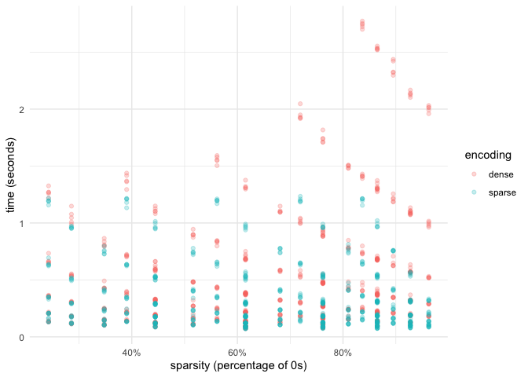
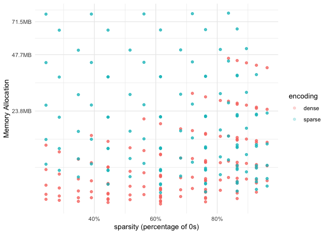
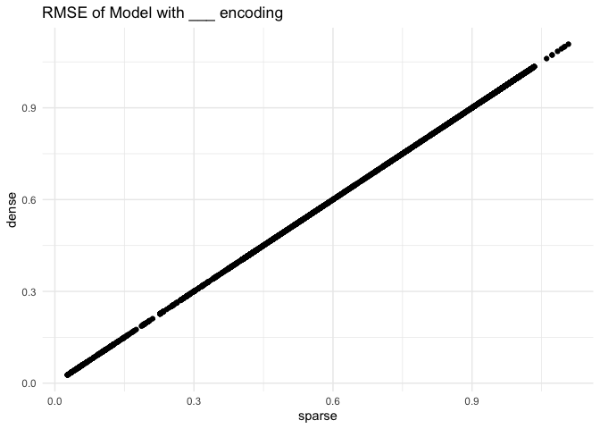
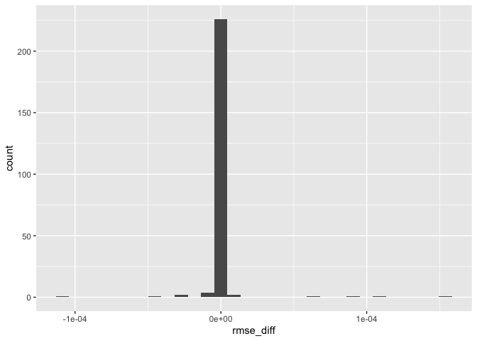

# Benchmark Sparsity Threshold Tidymodels


## How to run simulation

1.  Install {renv} package `pak::pak("renv")` and call
    `renv::restore()`. This will install the correct versions of
    packages.

2.  `source("make_files.R")` to set up simulation files.

3.  Call `make` from the terminal while being in `files/` directory.

4.  `source("collect_results.R")` to create a results data set.

5.  Run `quarto render readme.qmd` to update the readme with new
    results.

## Results

Loading packages and data.

``` r
library(tidyverse)

eval_data <- read_rds("simulation_results.rds") |>
  mutate(sparse_data = if_else(sparse_data, "sparse", "dense"))
```

`eval_data` data dictionary:

- `sparse_data`: Logical, whether data was encoded as a sparse tibble or
  not.
- `model`: Character, Which parsnip model was used.
- `n_numeric`: Numeric, Number of numeric columns. These columns are
  dense, meaning little to no 0 values.
- `n_counts`: Numeric, Number of counts columns. These columns are
  sparse, meaning almost all 0 values.
- `n_rows`: Numeric, Number of rows in the data set.
- `seed`: Numeric, seed value.
- `time`: Numeric, number of seconds it took to run
  `fit(wf_spec, data)`.
- `mem_alloc`: Numeric, amount of memory allocated when running
  `fit(wf_spec, data)`.
- `rmse`: Numeric, performance metric between predictions and true
  values.

Run-time by sparsity and encoding

``` r
eval_data |>
  ggplot(aes(sparsity, time, color = sparse_data)) +
  geom_point(alpha = 0.25) +
  theme_minimal() +
  scale_x_continuous(labels = scales::percent) +
  labs(
 x = "sparsity (percentage of 0s)",
 y = "time (seconds)",
 color = "encoding"
 )
```



Memory allocation by sparsity and encoding

``` r
eval_data |>
  ggplot(aes(sparsity, mem_alloc, color = sparse_data)) +
  geom_point(alpha = 0.25) +
  theme_minimal() +
  scale_x_continuous(labels = scales::percent) +
 bench::scale_y_bench_bytes() +
  labs(
 x = "sparsity (percentage of 0s)",
 y = "Memory Allocation",
 color = "encoding"
 )
```



Each model is made to predict on the training data, and calculate the
`yardstick::rmse()`. This value is compared between using sparse
encoding and dense encoding of the data to try to detect differences in
model fits.

``` r
rmse_tbl <- eval_data |>
  select(sparse_data, model, n_numeric, n_counts, n_rows, seed, rmse) |>
  pivot_wider(values_from = rmse, names_from = sparse_data, 
 names_prefix = "rmse_") |>
  mutate(rmse_diff = rmse_sparse - rmse_dense, .before = everything())
  
rmse_tbl |>
  ggplot(aes(rmse_sparse, rmse_dense)) +
  geom_point() +
  theme_minimal() +
  labs(
 title = "RMSE of Model with ___ encoding",
 x = "sparse",
 y = "dense"
 )
```



There ar some runs that doesn’t match performance

``` r
rmse_tbl |>
  summarise(nonzero = sum(rmse_diff != 0) / n())
```

    # A tibble: 1 × 1
      nonzero
        <dbl>
    1  0.0417

It happens for these models

``` r
rmse_tbl |>
  filter(rmse_diff != 0) |>
  count(model)
```

    # A tibble: 1 × 2
      model      n
      <chr>  <int>
    1 glmnet   240

It happens for these models

``` r
rmse_tbl |>
  filter(rmse_diff != 0) |>
  ggplot(aes(rmse_diff)) +
  geom_histogram()
```

    `stat_bin()` using `bins = 30`. Pick better value with `binwidth`.


